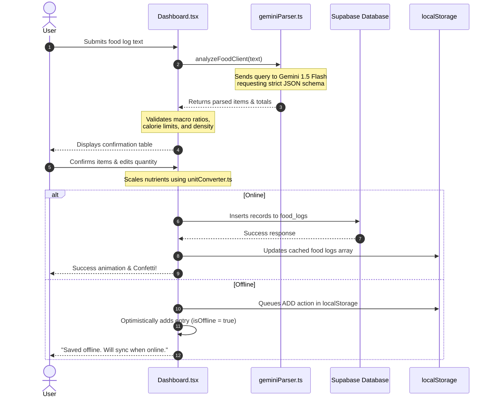

# Project Architecture & System Flow

This document provides a comprehensive overview of the **FoodLog** application structure, layers, system flows, and offline synchronization mechanisms.

---

## 1. Project Directory Structure

The repository is structured as a Vite-based single-page application (SPA) with a root orchestrator.

*   **[package.json](./package.json)**: Root configuration file containing scripts to install dependencies and run the frontend development server.
*   **[vercel.json](./vercel.json)**: Production deployment instructions for Vercel.
*   **[frontend/](./frontend)**: The main React application:
    *   **[frontend/src/types.ts](./frontend/src/types.ts)**: Shared interfaces for core datatypes like `FoodItem`, `FoodEntry`, `OfflineAction`, and `Message`.
    *   **[frontend/src/App.tsx](./frontend/src/App.tsx)**: Root component handling session checks and auth gating (Login/Signup).
    *   **[frontend/src/pages/Dashboard.tsx](./frontend/src/pages/Dashboard.tsx)**: Main page managing logging state, messages, offline synchronization, updates, and overall dashboard layout.
    *   **[frontend/src/lib/supabase.ts](./frontend/src/lib/supabase.ts)**: Configures the Supabase JS client client connection using anonymous keys.
    *   **[frontend/src/components/](./frontend/src/components)**:
        *   `NutritionDashboard.tsx`: Renders circular rings, daily goal tracking, logs tables, and status statistics.
        *   `ReviewConfirmTable.tsx`: Visualizes parsed food items for verification before commit.
        *   `ChatMessage.tsx` / `ChatInput.tsx`: Chat window elements.
    *   **[frontend/src/utils/](./frontend/src/utils)**:
        *   `geminiParser.ts`: Parses natural language food items using client-side Gemini requests and checks data sanity.
        *   `unitConverter.ts`: Converts various units of measure to standardize macronutrient scaling.

---

## 2. Architecture Layers

The architecture uses a three-tier system: UI, Logic, and Services:

```
┌────────────────────────────────────────────────────────┐
│                      UI LAYER                          │
│  React Components, Tailwind CSS, lucide-react Icons   │
└───────────┬──────────────────────────────┬─────────────┘
            │ (User Action / Local State)  │ (Auth Session)
            ▼                              ▼
┌────────────────────────────────────────────────────────┐
│                  APPLICATION LOGIC                     │
│  • Dashboard State & Optimistic UI Handler            │
│  • LocalStorage Cache & Offline Queue Manager          │
│  • Unit Conversion Helpers                             │
└───────────┬──────────────────────────────┬─────────────┘
            │ (REST / JSON Fetch)          │ (PostgREST API)
            ▼                              ▼
┌────────────────────────────────────────────────────────┐
│                    EXTERNAL APIs                       │
│  • Google Gemini API (v1beta) • Supabase BaaS Engine   │
└────────────────────────────────────────────────────────┘
```

---

## 3. Core System Flow

When a user logs a food description in the chat view:



---

## 4. Offline Synchronization Mechanism

The app tracks connection changes using standard browser events (`online` and `offline`).

1.  **Offline Action Queue**: Modifications (ADD, EDIT, DELETE) made while offline are saved in `localStorage` under `offline_pending_actions_<user.id>`.
2.  **Sync Event Trigger**: When the device regains connection, `syncOfflineActions` initiates:
    *   Iterates sequentially over actions.
    *   Sends matching updates or deletes to the Supabase table, or re-sends text descriptions to Gemini for parsing.
    *   Saves the resulting values to the database.
3.  **State Reset**: Clears successful tasks from the queue and refreshes dashboard logs.
